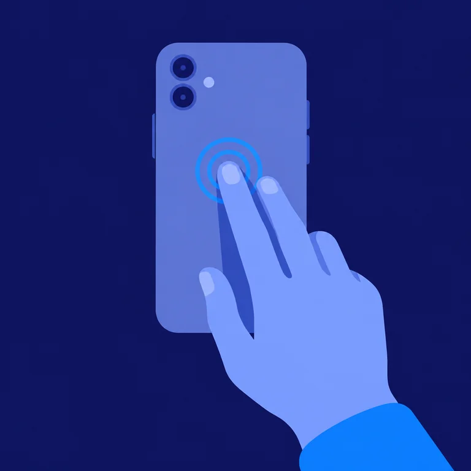
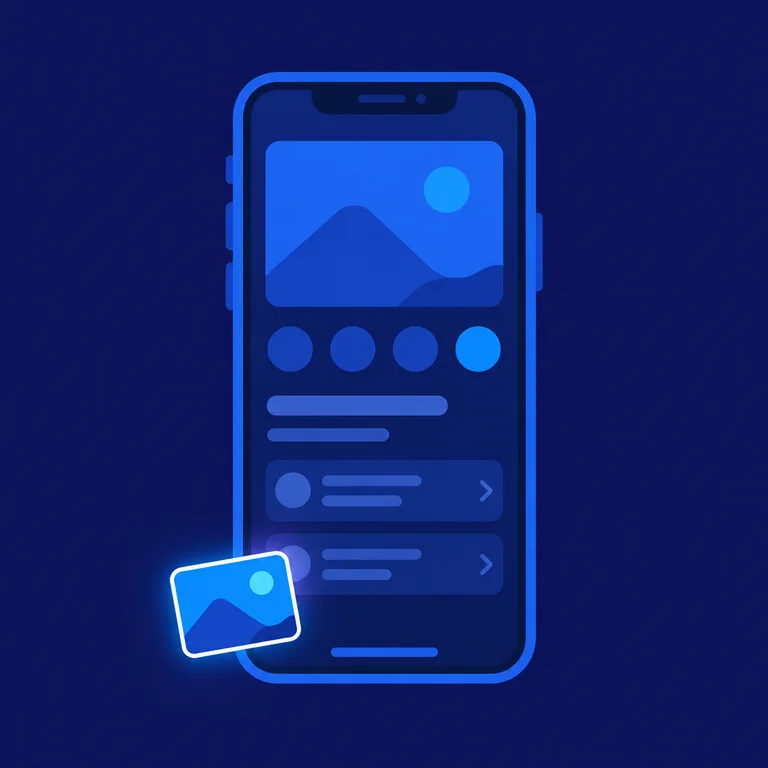
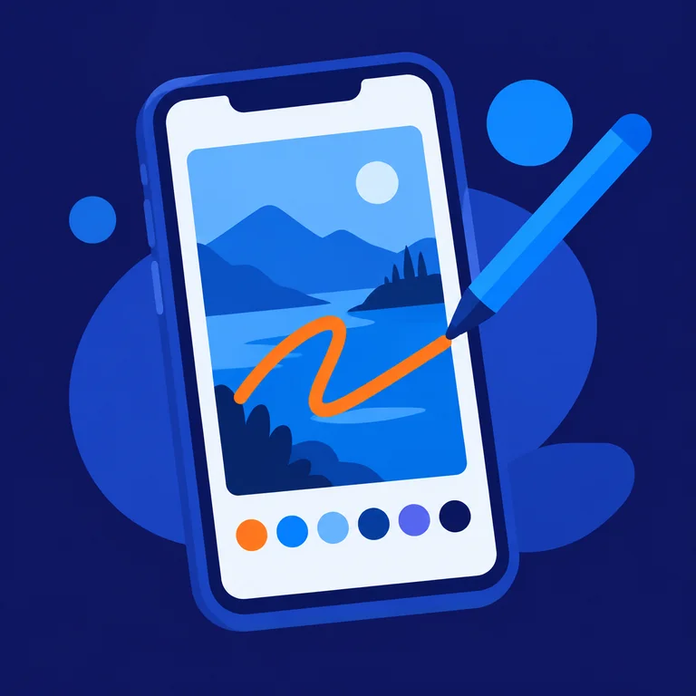

<div align="center">


# LibreShot

**iOS-style screenshots for Android.**

Capture, peek at the corner thumbnail, mark it up, and decide afterwards whether it was worth keeping.

[](LICENSE)
[](#requirements)
[](https://kotlinlang.org)
[](https://developer.android.com/compose)
[](#privacy)
[](#privacy)

</div>

Android writes every screenshot straight to your gallery, then leaves you to clean up
the ones you only needed for ten seconds. LibreShot borrows the iOS model instead: the
shot lands as a thumbnail in the corner, you glance at it, and it disappears unless you
act on it. Nothing is written to disk at capture time. The bitmap stays in memory until
you choose Save, Copy, or Share.

That is what makes an accidental capture harmless. A shot you did not mean to take is
never written anywhere: it expires by itself after a few seconds and leaves no file
behind. Your gallery only ever holds the screenshots you deliberately saved, so
misfires cannot quietly pile up in your camera roll.

It holds no permissions at all, has no network access, and ships no analytics.

## How it works

<table>
<tr>
<td width="33%"></td>
<td width="33%"></td>
<td width="33%"></td>
</tr>
<tr>
<td><b>1. Trigger it.</b> Double tap the back of the phone, or use the Quick Settings
tile. No system shutter animation, no notification.</td>
<td><b>2. Peek.</b> The shot shrinks into the corner for six seconds. Swipe it away to
discard, or ignore it and it discards itself. No file is written either way.</td>
<td><b>3. Mark up.</b> Tap the thumbnail to open the editor, then save, copy, or throw
it away.</td>
</tr>
</table>

## Capture triggers

| Trigger | Availability |
| --- | --- |
| Double tap on the back of the phone | Any device with an accelerometer. Off by default. |
| Quick Settings tile | Any device. |
| Quick Tap | Stock Pixel only, under Settings > System > Gestures > Quick Tap > Open app. |
| Capture shortcut | Long press the launcher icon. A plain tap opens Settings instead. |
| Volume down, pressed twice | Any device. Off by default. |

The back tap runs on a small accelerometer heuristic rather than a machine learning
model: a z-dominant spike pair, 80 to 400 ms apart, with a one second cooldown. It
costs no permissions and no native code, and it can be tuned between three sensitivity
levels in Settings. A false trigger is cheap by design, since an unwanted capture just
peeks and vanishes without ever reaching your gallery.

## The editor

Pen, marker, pencil, and an object eraser that removes whole strokes rather than
scrubbing pixels. Colour presets plus an HSV picker. Undo and redo, including the
three-finger gestures. Two-finger pan and zoom. An iOS-style crop with corner brackets,
a dimmed scrim, and a rule-of-thirds grid, which stays non-destructive until export and
takes part in the undo timeline.

Closing the editor opens the Done sheet: Save to Photos, Copy, Copy and Delete, or
Delete Screenshot.

Lasso, ruler, text, shapes, magnifier, and signature are not built yet.

## Privacy

Capture goes through `AccessibilityService.takeScreenshot()`, which is worth
understanding before you trust it. An accessibility service can be granted a lot of
reach, so this one is declared as narrowly as the platform allows:

- Captures are held in memory only. Nothing reaches storage unless you pick Save,
  Copy, or Share, so an unintended trigger leaves nothing behind to clean up.
- It requests `canTakeScreenshot`, and `canRequestFilterKeyEvents` only while the
  optional volume chord is switched on. It does **not** request
  `canRetrieveWindowContent`, so it cannot read what is on your screen.
- It subscribes to zero accessibility events.
- No `INTERNET` permission, so nothing can leave the device even in principle. The
  manifest declares no permissions whatsoever.
- The back tap reads the accelerometer only while the toggle is on and the screen is
  awake. Motion data is never stored.
- Copied images are flagged sensitive, which keeps them out of the Android 13 and newer
  clipboard preview and clipboard history.
- No capture fires while the device is locked, whichever trigger you use.

Verify the permission claim yourself rather than taking it on faith:

```
aapt dump permissions app-release.apk
```

## Security model

The capture trampoline has to be an exported activity, because that is the only way
Quick Tap and the launcher can reach it. Any installed app can therefore ask it to fire.
That is a deliberate, bounded trade, and the bounds are worth stating plainly:

- A triggered capture is always visible. The flash and thumbnail appear, or the editor
  opens. Nothing happens silently.
- The bitmap never leaves the process. No file is written at capture time and no
  component hands pixels to a caller, so a hostile app can cause a screenshot but
  cannot read one.
- Requests are clamped to a two second delay and rate limited to one capture per 400 ms.

`LaunchRouter` decides whether an incoming intent captures or opens Settings. It is
convenience routing, not an authorization boundary, and the code says so.

## Requirements

Android 13 (API 33) or newer.

## Install

No published build yet, so compile it yourself:

```
git clone https://github.com/WFT345/libreshot.git
cd libreshot
./gradlew installDebug
```

Then open the app once and follow the onboarding, which walks through enabling the
service under Settings > Accessibility > Installed apps.

## Build

```
./gradlew assembleDebug        # debug APK
./gradlew testDebugUnitTest    # unit tests
./gradlew installDebug         # install on a connected device
```

For a signed release build, copy `signing.properties.example` to `signing.properties`
and fill it in. That file and the keystore are both git-ignored.

Useful during development:

```
adb shell settings put secure enabled_accessibility_services app.libreshot/.capture.CaptureService
adb shell am start app.libreshot/.capture.CaptureActivity    # same path Quick Tap takes
adb shell service call clipboard 2                           # inspect the clipboard
```

## Project layout

```
app/src/main/java/app/libreshot/
  capture/     accessibility service, triggers, trampoline activity
  editor/      Compose markup editor, stroke model, crop overlay
  export/      bitmap compositing and MediaStore writes
  overlay/     corner peek thumbnail
  session/     in-memory screenshot store
  share/       clipboard, FileProvider sharing, cache pruning
  settings/    DataStore preferences and the settings screen
```

Logic that can be tested without a device is deliberately kept free of Android types.
The detectors, the rate limiter, the crop geometry, and the launch router are all plain
Kotlin, covered by 54 JVM unit tests.

## License

[GPL-3.0](LICENSE).
